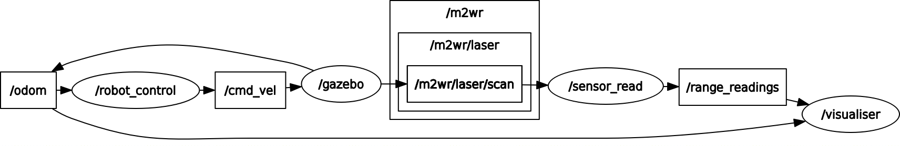

# localisation-mcl
visualisation of MCL use ros and gazebo in headless mode 
to run the program , clone the repository to catkin_ws/src

do ```catkin_make``` && ```source devel/setup.bash```

launch command is ```roslaunch sem_localise no_gui_spawn.launch``` 
where sem_localise is the name of the package 

use the launch file ```launch/spawn.launch``` to start gzebo in GUI mode

# ROS GRAPH



# Visualiser


